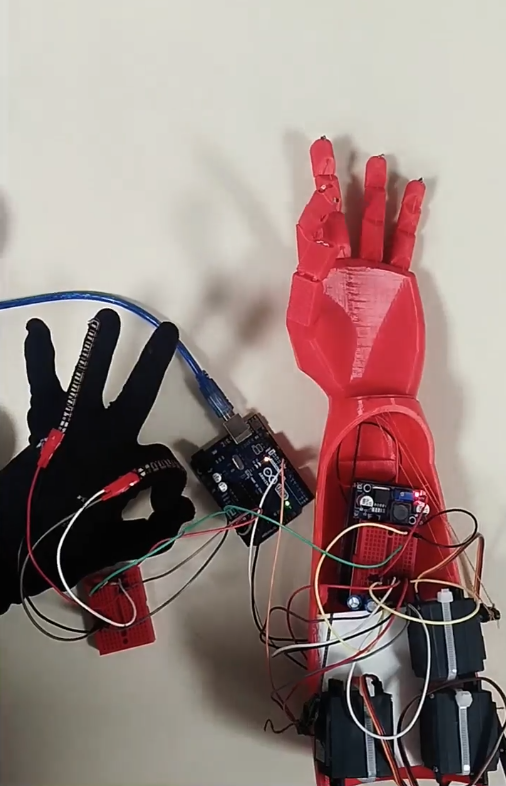

# Gesture Mimicry

A flex-sensor-based gesture mimicry system developed as a course project,
using a glove-mounted sensing circuit to control a servo-actuated robotic hand.

## Overview

The system captures finger bending using flex sensors mounted on a glove
and reproduces the corresponding finger movements on a 3D-printed robotic
hand.

## System

Flex Sensors → Signal Conditioning → Arduino → Servo Control → Robotic Hand

## Hardware

- Arduino Uno
- Flex sensors
- Servo motors
- 3D-printed robotic hand
- Glove-mounted sensing circuit
- Battery power supply
- Supporting electronic components

## Implementation

- Integrated flex sensors on a glove to capture finger-bending movements.
- Interfaced the sensors with an Arduino Uno for gesture acquisition.
- Mapped sensor readings to servo positions for corresponding finger motion.
- Implemented power and signal conditioning measures to reduce servo
  chatter and improve movement stability.

## Demonstration

[Watch the demonstration video](https://drive.google.com/file/d/13xTDukmmgixJmYaPmwgZ1uDa9TOgZNFt/view?usp=sharing)

## Skills Demonstrated

- Sensor integration
- Analog signal interfacing
- Embedded control
- Servo motor control
- Circuit design and troubleshooting

